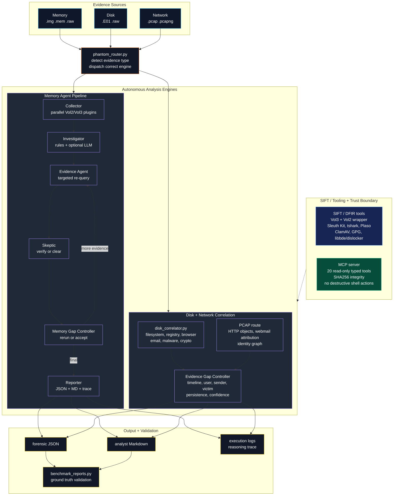

# PHANTOM DFIR
## Parallel Hypothesis Analysis with Multi-agent Threat Hunting Overlay Network


> **The world's first adversarial self-verifying DFIR agent**
> Built on LangGraph + Ollama | Runs entirely on SANS SIFT Workstation | 100% Free

---

## The Core Innovation

Every existing DFIR tool - including Protocol SIFT - uses a **single agent** that never cross-examines its own claims. PHANTOM uses **two agents that argue**:

```
Investigator: "ruby.exe from services.exe - is this Metasploit?"
Path Checker:  ruby.exe at C:\Program Files\Puppet Labs\ - BENIGN
Skeptic:       "[OK] CLEARED - Puppet Labs Ruby, not malicious"
Result:        Investigated, confirmed benign - no false positive!
```

```
Investigator: "subject_srv.exe running from non-System32 path"
Skeptic:      "Prove it with 3 independent raw evidence sources"
Evidence:     [re-runs pslist, svcscan, shimcache on that PID]
Result:       19/19 sources confirmed -> [CRITICAL] CRITICAL (verified, not hallucinated)
```

**No DFIR tool in the world does this.**

---

## Try-It-Out Instructions

### Prerequisites
- **SANS SIFT Workstation** (VM or bare metal)
- **Python 3.10+** (pre-installed on SIFT)
- **Volatility 3** (`pip install volatility3` - pre-installed on SIFT)
- **Ollama** with `qwen2.5:14b` model (optional - works without LLM in `--no-llm` mode)
- **Sleuth Kit** (`mmls`, `fls`, `icat`) for disk/E01 analysis
- **tshark** for PCAP analysis
- **ClamAV / clamdscan** for faster malware triage
- **libbde / dislocker / gpg** for BitLocker and GPG challenge recovery

PHANTOM DFIR supports both:

- Windows WSL2 / Kali / Ubuntu
- SANS SIFT Workstation

---
# Automatic Installation (Recommended)

PHANTOM includes an automated installer that:

- Creates a Python 3 virtual environment at `.venv`
- Installs required PHANTOM dependencies
- Clones and validates Volatility 3 at `~/volatility3`
- Creates a Python 2.7 Volatility 2 environment at `~/vol2_env`
- Clones and validates Volatility 2.6.1 at `~/volatility2`
- Creates `vol` and `vol2` launchers in `~/.local/bin`
- Installs MCP/FastAPI packages
- Prepares Volatility symbol cache
- Creates `~/phantom` and `~/phantom-memory` launchers

Run:

```bash
git clone https://github.com/romilp619/Phantom-DFIR.git

cd Phantom-DFIR

bash install.sh
```

For full native SIFT/Ubuntu dependencies:

```bash
bash install.sh --with-system-deps
```

Validate installation:

```bash
bash install.sh --check
vol -h
vol2 --info
```

Run PHANTOM:

```bash
~/phantom /path/to/evidence --deep --no-llm
~/phantom-memory -f /path/to/memory.img --no-llm --self-correct
```

# Option 1 - SANS SIFT Workstation

Recommended for:
- Professional DFIR workflows
- Forensic lab environments
- Hackathon demo environments

IMPORTANT:
SIFT ships with a system-installed Volatility that may cause symbol permission issues.

PHANTOM solves this by using a local Python virtual environment.

---

## Prerequisites

- SANS SIFT Workstation
- Python 3.10+
- Internet connection (required for first Windows symbol download)

---

## Step 1: Clone Repository

```bash
cd ~

git clone https://github.com/romilp619/Phantom-DFIR.git

cd Phantom-DFIR
```

---

## Step 2: Run Installer

```bash
bash install.sh
```

Installer automatically:
- creates `.venv`
- installs PHANTOM Python dependencies
- clones and validates Volatility 3
- creates and validates a dedicated Volatility 2 Python 2 environment
- creates `vol` and `vol2` launchers
- installs MCP/FastAPI dependencies
- configures local environment
- prepares symbol cache

---

## Step 3: Activate Environment

```bash
source .venv/bin/activate
```

---

## Step 4: Install Ollama (Optional)

```bash
curl -fsSL https://ollama.com/install.sh | sh
```

Start Ollama:

```bash
ollama serve
```

Pull model:

```bash
ollama pull qwen2.5:14b
```

---

## Step 5: First Volatility Symbol Download

Run once:

```bash
vol -f /path/to/memory.img windows.info
```

IMPORTANT:
- First run may take 5-15 minutes
- Do NOT interrupt symbol download
- This caches Microsoft kernel symbols locally

---

## Volatility 2 Wrapper

PHANTOM supports both Volatility 3 and Volatility 2 because some older Windows memory images still parse better with Volatility 2 profiles. Volatility 2 depends on Python 2.7-era packages, so the installer keeps it isolated from PHANTOM's Python 3 `.venv`.

The installer creates:

```text
~/vol2_env          # Python 2.7 virtual environment
~/volatility2       # Volatility 2.6.1 source checkout
~/.local/bin/vol2   # convenience launcher
```

The `vol2` launcher is:

```bash
#!/bin/bash
source ~/vol2_env/bin/activate
python ~/volatility2/vol.py "$@"
```

Validate it:

```bash
bash install.sh --check
python2 -c "import distorm3"
vol2 --info
vol2 -f memory.raw imageinfo
```

---

## Step 6: Run Analysis

### Full analysis (with LLM)

```bash
python3 main.py -f /path/to/memory.img
```

### Rule-based only

```bash
python3 main.py -f /path/to/memory.img --no-llm
```

### Custom model

```bash
python3 main.py -f /path/to/memory.img --model qwen2.5:14b
```

---

## Step 7: Benchmark Accuracy

```bash
python3 benchmark.py \
  -f /path/to/memory.img \
  --ground-truth ground_truth_base_admin.json
```

---

## Step 8: MCP Server

### Terminal 1

```bash
python3 mcpserver/mcp_server.py --transport http --port 8765
```

### Terminal 2

```bash
python3 test_mcp.py --memory /path/to/memory.img
```

---

## Step 9: Memory + Disk Correlation

```bash
python3 disk_correlator.py \
  -m /path/to/memory.img \
  -d /path/to/disk.E01
```

---


# Option 2 - Windows WSL / Kali / Ubuntu

Recommended for:
- Faster setup
- Local development
- Easier Volatility configuration

## Prerequisites

- Windows WSL2, Kali Linux, or Ubuntu
- Python 3.10+
- Git
- Internet connection (for initial Volatility symbol download)

---

## Step 1: Clone Repository

```bash
cd ~

git clone https://github.com/romilp619/Phantom-DFIR.git

cd Phantom-DFIR
```

---

## Step 2: Create Virtual Environment

```bash
python3 -m venv venv

source venv/bin/activate
```

---

## Step 3: Install Dependencies

```bash
pip install -r requirements.txt

pip install volatility3 fastapi uvicorn mcp pefile pyAesCrypt
```

---

## Step 3A: Install System DFIR Tools

PHANTOM calls many native forensic tools directly. On Ubuntu/WSL/SIFT, install
the common external dependencies with:

```bash
sudo apt update
sudo apt install -y \
  sleuthkit \
  tshark \
  ewf-tools \
  plaso \
  clamav \
  clamav-daemon \
  libbde-utils \
  dislocker \
  gnupg
```

Some distros package libbde differently. Verify the crypto tools with:

```bash
which gpg
which dislocker
which bdemount
which bdeinfo
```

---

## Step 3B: Enable ClamAV / clamdscan

PHANTOM's malware triage prefers `clamdscan --multiscan` because the daemon
keeps signatures loaded in memory. If unavailable, PHANTOM falls back to
`clamscan`, which works but can be slower.

Install and update signatures:

```bash
sudo apt install -y clamav clamav-daemon
sudo systemctl stop clamav-freshclam 2>/dev/null || true
sudo freshclam
sudo systemctl enable --now clamav-daemon 2>/dev/null || sudo service clamav-daemon start
```

Verify:

```bash
which clamdscan
clamdscan --version
clamdscan --ping
```

If `clamdscan --ping` fails in WSL, start the daemon manually:

```bash
sudo service clamav-daemon start
```

## Step 4: Install Ollama (Optional)

```bash
curl -fsSL https://ollama.com/install.sh | sh
```

Start Ollama:

```bash
ollama serve
```

Pull model:

```bash
ollama pull qwen2.5:14b
```

---

## Step 5: First Volatility Symbol Download

Run once:

```bash
vol -f /path/to/memory.img windows.info
```

IMPORTANT:
- First run may take 5-15 minutes
- Do NOT interrupt symbol download

---

## Step 6: Run Analysis

### Full analysis (with LLM)

```bash
python3 main.py -f /path/to/memory.img
```

### Rule-based only (deterministic)

```bash
python3 main.py -f /path/to/memory.img --no-llm
```

### Custom model

```bash
python3 main.py -f /path/to/memory.img --model qwen2.5:14b
```

---

## Step 7: Benchmark Accuracy

```bash
python3 benchmark.py \
  -f /path/to/memory.img \
  --ground-truth ground_truth_base_admin.json
```

---

## Step 8: MCP Server

### Terminal 1

```bash
python3 mcpserver/mcp_server.py --transport http --port 8765
```

### Terminal 2

```bash
python3 test_mcp.py --memory /path/to/memory.img
```

---

## Step 9: Memory + Disk Correlation

```bash
python3 disk_correlator.py \
  -m /path/to/memory.img \
  -d /path/to/disk.E01
```

---

## Disk, E01, and PCAP Analysis

Run a disk/E01 image in deep mode:

```bash
python3 disk_correlator.py -d /path/to/image.E01 --deep
```

For large E01 images where generic email settings are not relevant, skip slow
broad email-setting string scans:

```bash
python3 disk_correlator.py \
  -d /path/to/image.E01 \
  --deep \
  --skip-email-settings
```

Run a PCAP/PCAPNG:

```bash
python3 disk_correlator.py -d /path/to/network.pcap --deep
```

---

## Unified Router: `phantom_router.py`

Use `phantom_router.py` when you want one command that automatically detects
whether the input is memory, disk/E01/raw, or PCAP evidence.

The router:

- detects evidence type from extension and file magic;
- runs `main.py` for memory evidence;
- runs `disk_correlator.py` for disk and PCAP evidence;
- collects generated report paths;
- optionally calls the configured LLM provider;
- runs the evidence-gap controller;
- writes unified `phantom_unified_*.json` and `phantom_unified_*.md` reports.

Dry run, showing what command would execute:

```bash
python3 phantom_router.py /path/to/evidence --deep --dry-run --no-llm
```

Run without LLM:

```bash
python3 phantom_router.py /path/to/evidence --deep --no-llm
```

Run with Ollama:

```bash
python3 phantom_router.py /path/to/evidence \
  --deep \
  --provider ollama \
  --model qwen2.5:14b \
  --gap-confidence 0.85
```

Examples:

```bash
python3 phantom_router.py /cases/base-admin-memory.img --self-correct --no-llm
python3 phantom_router.py /cases/SysInternalsCase.E01 --deep --no-llm
python3 phantom_router.py /cases/nitroba.pcap --deep --no-llm
```

---

## Multi-Case Benchmark Commands

Score one final PHANTOM report:

```bash
python3 benchmark_reports.py \
  --case <case_id> \
  --report /path/to/phantom_report.json \
  --output benchmark_results/<case_id>_benchmark_result.json
```

Supported case IDs:

```text
base_admin_memory
sysinternals_case
ali_hadi_web_server
cfreds_data_leakage
ali_hadi_encrypt_them_all
m57_jean_phishing
nitroba_harassment_pcap
```

Examples:

```bash
python3 benchmark_reports.py \
  --case ali_hadi_encrypt_them_all \
  --report "/home/romil/phantom_correlation_A (disk-only)_AF-Case2_E01_20260613_182951.json" \
  --output benchmark_results/encrypt_them_all_benchmark_result.json

python3 benchmark_reports.py \
  --case nitroba_harassment_pcap \
  --report "/home/romil/phantom_correlation_A (disk-only)_nitroba_pcap_20260613_111646.json" \
  --output benchmark_results/nitroba_benchmark_result.json
```

Score latest reports in a flat output directory:

```bash
python3 benchmark_reports.py \
  --all \
  --reports-dir /path/to/final/reports \
  --latest \
  --output benchmark_results/all_cases_benchmark_summary.json
```

Final judge benchmark summary committed in `benchmark_results/`:

```text
Cases scored: 5
Fully reproduced: 5
Average adjusted score: 97.0%
Verdicts matched: 5/5
```

---

# Output Files

After each run, PHANTOM generates:

- `phantom_<target>_<timestamp>.json`
  -> Full structured findings report

- `phantom_<target>_<timestamp>.md`
  -> Human-readable forensic report

- `phantom_<target>_<timestamp>_execution_log.json`
  -> Multi-agent reasoning trace

- `phantom_<target>_progress.json`
  -> Iteration improvement metrics

---

## Architecture




> **Security**: Architectural guardrails (no shell access, SHA256 verify, read-only subprocess, max iteration cap) vs prompt guardrails (IOC validation, JSON schema, static fallback). See [ARCHITECTURE.md](ARCHITECTURE.md) for full trust boundary documentation.

---

## Expected Output

```
[CRITICAL] CRITICAL - subject_srv.exe running from non-System32 path
   |--- 19 independent sources confirmed
   |--- vol3:svcscan, shimcache, pslist, ldrmodules ...
   --- ATT&CK: T1543.003

[CRITICAL] CRITICAL - C2 connection to 172.16.4.10:8080
   |--- 3 sources: netscan, netstat, netscan_live
   --- ATT&CK: T1071.001

[CRITICAL] CRITICAL - putty.exe - lateral SSH movement
   |--- 20 sources confirmed
   |--- SSH targets: onion-master, base-elk, proxy
   --- ATT&CK: T1021.004

[OK] CLEARED - ruby.exe from Puppet Labs (investigated, benign)
   |--- Path: C:\Program Files\Puppet Labs\Puppet\sys\ruby\bin\ruby.exe
   --- 18 sources checked, all confirmed benign path

ATT&CK Chain: T1543.003 -> T1071.001 -> T1021.004
[ZERO] 0 hallucinations | [OK] 1 process cleared
```

---

## File Structure

```
phantom-dfir/
|--- main.py               # CLI entry point
|--- config.py             # Tool paths, Ollama settings, timeouts
|--- state.py              # LangGraph TypedDict state schema
|--- install.sh            # One-command SIFT installer
|--- requirements.txt      # Python dependencies
|--- tools/
|   |--- vol3_tools.py     # Vol3 (vol) wrappers - 40+ Windows + 30+ Linux plugins
|   --- vol2_tools.py     # Vol2 (vol2) wrappers - auto-profile detection
|--- agents/
|   |--- orchestrator.py   # LangGraph StateGraph + reasoning_log init
|   |--- collector.py      # Parallel OS detection + evidence collection (16 workers)
|   |--- investigator.py   # Dynamic hypothesis generation (LLM + rule-based)
|   |--- evidence.py       # Targeted re-queries per hypothesis (Win + Linux)
|   |--- skeptic.py        # Adversarial challenge engine
|   --- reporter.py       # Final report + reasoning trace + execution log
|--- correlation/
|   |--- confidence.py     # Multi-source IOC scoring
|   |--- mitre.py          # ATT&CK technique auto-mapping (false-positive-free)
|   --- timeline.py       # Dynamic attack timeline reconstruction
|--- mcpserver/
|   --- mcp_server.py     # 20 typed MCP tools (stdio + HTTP)
|--- disk_correlator.py    # Memory<->Disk cross-reference engine
|--- phantom_router.py     # Unified evidence router + evidence-gap controller
|--- benchmark.py          # Accuracy benchmarking (precision/recall/F1)
|--- benchmark_reports.py  # Multi-case report benchmark validator
|--- benchmark_results/    # Final judge-facing scorecards
|--- benchmarks/           # Multi-case ground truth definitions
|--- ground_truth_base_admin.json  # Known-good ground truth for scoring
--- test_mcp.py           # MCP server smoke test
```

---

## v2.1 Improvements (Latest)

| Area | v2.0 | v2.1 |
|------|------|------|
| **False positives** | Ruby flagged as Metasploit C2 | [OK] CLEARED - path-aware benign detection |
| **Confidence levels** | CRITICAL/MEDIUM/LOW/REFUTED | + **CLEARED** (investigated, benign) |
| **Report quality** | IOC list | **Attack narrative** - coherent breach story |
| **Timeline** | All events incl. system noise | **Attacker-focused** - VMware/Defender filtered |
| **Evidence quotes** | IOC name only (`ruby.exe`) | Rich forensic lines with PIDs, paths, timestamps |
| **MITRE accuracy** | ruby.exe -> false T1059 | Ruby removed from IOC map, zero false positives |
| **Timeline events** | Raw Volatility output | **Human-readable** (`Process 'ruby.exe' (PID 3204) created`) |

## v2.0 Improvements

| Area | v1.0 | v2.0 |
|------|------|------|
| **Speed** | 8 parallel workers -> 306s collection | 16 workers -> ~150-180s collection |
| **MITRE accuracy** | 5/13 false positives (tool names as IOCs) | IOC-only mapping, zero false positives |
| **IOC detection** | Hardcoded IPs/ports | Dynamic extraction from evidence |
| **SSH analysis** | None | Extracts @hostname targets from cmdlines |
| **Remediation** | Hardcoded to test case | Dynamic from attack phases + MITRE |
| **Timeline** | Hardcoded keywords | Dynamic from discovered IOCs |
| **Vol2 profile** | Hardcoded Win10x64_16299 | Auto-detect via kdbgscan |
| **Linux support** | Collection only | Collection + Evidence verification |
| **Plugin timeouts** | 300s slow plugins | 180s (faster failure) |

---


*PHANTOM DFIR v2.1 - Find Evil! Hackathon 2026*
