# PHANTOM DFIR
## Parallel Hypothesis Analysis with Multi-agent Threat Hunting Overlay Network


> **The world's first adversarial self-verifying DFIR agent**
> Built on LangGraph + Ollama · Runs entirely on SANS SIFT Workstation · 100% Free

---

## The Core Innovation

Every existing DFIR tool — including Protocol SIFT — uses a **single agent** that never cross-examines its own claims. PHANTOM uses **two agents that argue**:

```
Investigator: "ruby.exe from services.exe — is this Metasploit?"
Path Checker:  ruby.exe at C:\Program Files\Puppet Labs\ — BENIGN
Skeptic:       "✅ CLEARED — Puppet Labs Ruby, not malicious"
Result:        Investigated, confirmed benign — no false positive!
```

```
Investigator: "subject_srv.exe running from non-System32 path"
Skeptic:      "Prove it with 3 independent raw evidence sources"
Evidence:     [re-runs pslist, svcscan, shimcache on that PID]
Result:       19/19 sources confirmed → 🔴 CRITICAL (verified, not hallucinated)
```

**No DFIR tool in the world does this.**

---

## Try-It-Out Instructions

### Prerequisites
- **SANS SIFT Workstation** (VM or bare metal)
- **Python 3.10+** (pre-installed on SIFT)
- **Volatility 3** (`pip install volatility3` — pre-installed on SIFT)
- **Ollama** with `qwen2.5:14b` model (optional — works without LLM in `--no-llm` mode)

PHANTOM DFIR supports both:

- Windows WSL2 / Kali / Ubuntu
- SANS SIFT Workstation

---
# Automatic Installation (Recommended)

PHANTOM includes an automated installer that:

- Creates a Python virtual environment
- Installs required dependencies
- Installs Volatility 3
- Installs MCP/FastAPI packages
- Prepares Volatility symbol cache
- Creates a `~/phantom` launcher

Run:

```bash
git clone https://github.com/YOUR_USERNAME/Phantom-DFIR.git

cd Phantom-DFIR

bash install.sh
```

After installation:

```bash
source .venv/bin/activate
```

Run PHANTOM:

```bash
python3 main.py -f /path/to/memory.img
```

# Option 1 — SANS SIFT Workstation

Recommended for:
- Professional DFIR workflows
- Forensic lab environments
- Hackathon demo environments

IMPORTANT:
SIFT ships with a system-installed Volatility that may cause symbol permission issues.

PHANTOM solves this by using a local Python virtual environment.

---

## Prerequisites

- SANS SIFT Workstation
- Python 3.10+
- Internet connection (required for first Windows symbol download)

---

## Step 1: Clone Repository

```bash
cd ~

git clone https://github.com/YOUR_USERNAME/Phantom-DFIR.git

cd Phantom-DFIR
```

---

## Step 2: Run Installer

```bash
bash install.sh
```

Installer automatically:
- creates venv
- installs Volatility 3
- installs MCP/FastAPI dependencies
- configures local environment
- prepares symbol cache

---

## Step 3: Activate Environment

```bash
source .venv/bin/activate
```

---

## Step 4: Install Ollama (Optional)

```bash
curl -fsSL https://ollama.com/install.sh | sh
```

Start Ollama:

```bash
ollama serve
```

Pull model:

```bash
ollama pull qwen2.5:14b
```

---

## Step 5: First Volatility Symbol Download

Run once:

```bash
vol -f /path/to/memory.img windows.info
```

IMPORTANT:
- First run may take 5–15 minutes
- Do NOT interrupt symbol download
- This caches Microsoft kernel symbols locally

---

## Step 6: Run Analysis

### Full analysis (with LLM)

```bash
python3 main.py -f /path/to/memory.img
```

### Rule-based only

```bash
python3 main.py -f /path/to/memory.img --no-llm
```

### Custom model

```bash
python3 main.py -f /path/to/memory.img --model qwen2.5:14b
```

---

## Step 7: Benchmark Accuracy

```bash
python3 benchmark.py \
  -f /path/to/memory.img \
  --ground-truth ground_truth_base_admin.json
```

---

## Step 8: MCP Server

### Terminal 1

```bash
python3 mcpserver/mcp_server.py --transport http --port 8765
```

### Terminal 2

```bash
python3 test_mcp.py --memory /path/to/memory.img
```

---

## Step 9: Memory + Disk Correlation

```bash
python3 disk_correlator.py \
  -m /path/to/memory.img \
  -d /path/to/disk.E01
```

---


# Option 2 — Windows WSL / Kali / Ubuntu

Recommended for:
- Faster setup
- Local development
- Easier Volatility configuration

## Prerequisites

- Windows WSL2, Kali Linux, or Ubuntu
- Python 3.10+
- Git
- Internet connection (for initial Volatility symbol download)

---

## Step 1: Clone Repository

```bash
cd ~

git clone https://github.com/YOUR_USERNAME/Phantom-DFIR.git

cd Phantom-DFIR
```

---

## Step 2: Create Virtual Environment

```bash
python3 -m venv venv

source venv/bin/activate
```

---

## Step 3: Install Dependencies

```bash
pip install -r requirements.txt

pip install volatility3 fastapi uvicorn mcp pefile
```

---

## Step 4: Install Ollama (Optional)

```bash
curl -fsSL https://ollama.com/install.sh | sh
```

Start Ollama:

```bash
ollama serve
```

Pull model:

```bash
ollama pull qwen2.5:14b
```

---

## Step 5: First Volatility Symbol Download

Run once:

```bash
vol -f /path/to/memory.img windows.info
```

IMPORTANT:
- First run may take 5–15 minutes
- Do NOT interrupt symbol download

---

## Step 6: Run Analysis

### Full analysis (with LLM)

```bash
python3 main.py -f /path/to/memory.img
```

### Rule-based only (deterministic)

```bash
python3 main.py -f /path/to/memory.img --no-llm
```

### Custom model

```bash
python3 main.py -f /path/to/memory.img --model qwen2.5:14b
```

---

## Step 7: Benchmark Accuracy

```bash
python3 benchmark.py \
  -f /path/to/memory.img \
  --ground-truth ground_truth_base_admin.json
```

---

## Step 8: MCP Server

### Terminal 1

```bash
python3 mcpserver/mcp_server.py --transport http --port 8765
```

### Terminal 2

```bash
python3 test_mcp.py --memory /path/to/memory.img
```

---

## Step 9: Memory + Disk Correlation

```bash
python3 disk_correlator.py \
  -m /path/to/memory.img \
  -d /path/to/disk.E01
```

---

# Output Files

After each run, PHANTOM generates:

- `phantom_<target>_<timestamp>.json`
  → Full structured findings report

- `phantom_<target>_<timestamp>.md`
  → Human-readable forensic report

- `phantom_<target>_<timestamp>_execution_log.json`
  → Multi-agent reasoning trace

- `phantom_<target>_progress.json`
  → Iteration improvement metrics

---

## Architecture

```mermaid
flowchart TB
    subgraph INPUT["📥 Evidence Input"]
        MEM["🧠 Memory Image (.img)"]
        DISK["💾 Disk Image (.E01)"]
    end

    subgraph PIPELINE["⚡ LangGraph Multi-Agent Pipeline"]
        direction TB
        COL["🔍 COLLECTOR\n35+ plugins · 16 workers"]
        INV["🧪 INVESTIGATOR\nStatic rules + LLM"]
        EVD["📋 EVIDENCE\nPID-targeted re-queries"]
        SKP["⚔️ SKEPTIC\nAdversarial debate"]
        RPT["📊 REPORTER\nJSON + MD + Trace"]

        COL --> INV --> EVD --> SKP
        SKP -->|"🔄 self-correction (max 3)"| EVD
        SKP -->|"✅ final"| RPT
    end

    subgraph MCP["🔌 MCP Server — 20 Read-Only Tools"]
        TOOLS["SHA256 integrity · stdio + HTTP · ⛔ No destructive commands"]
    end

    MEM --> COL
    DISK --> COL
    MCP -.->|tool calls| COL
    MCP -.->|tool calls| EVD
    RPT --> O1["findings.json"] & O2["report.md"] & O3["execution_log.json"] & O4["progress.json"]
```



> **Security**: Architectural guardrails (no shell access, SHA256 verify, read-only subprocess, max iteration cap) vs prompt guardrails (IOC validation, JSON schema, static fallback). See [ARCHITECTURE.md](ARCHITECTURE.md) for full trust boundary documentation.

---

## Expected Output

```
🔴 CRITICAL — subject_srv.exe running from non-System32 path
   ├── 19 independent sources confirmed
   ├── vol3:svcscan, shimcache, pslist, ldrmodules ...
   └── ATT&CK: T1543.003

🔴 CRITICAL — C2 connection to 172.16.4.10:8080
   ├── 3 sources: netscan, netstat, netscan_live
   └── ATT&CK: T1071.001

🔴 CRITICAL — putty.exe — lateral SSH movement
   ├── 20 sources confirmed
   ├── SSH targets: onion-master, base-elk, proxy
   └── ATT&CK: T1021.004

✅ CLEARED — ruby.exe from Puppet Labs (investigated, benign)
   ├── Path: C:\Program Files\Puppet Labs\Puppet\sys\ruby\bin\ruby.exe
   └── 18 sources checked, all confirmed benign path

ATT&CK Chain: T1543.003 → T1071.001 → T1021.004
⚫ 0 hallucinations | ✅ 1 process cleared
```

---

## File Structure

```
phantom-dfir/
├── main.py               # CLI entry point
├── config.py             # Tool paths, Ollama settings, timeouts
├── state.py              # LangGraph TypedDict state schema
├── install.sh            # One-command SIFT installer
├── requirements.txt      # Python dependencies
├── tools/
│   ├── vol3_tools.py     # Vol3 (vol) wrappers — 40+ Windows + 30+ Linux plugins
│   └── vol2_tools.py     # Vol2 (vol2) wrappers — auto-profile detection
├── agents/
│   ├── orchestrator.py   # LangGraph StateGraph + reasoning_log init
│   ├── collector.py      # Parallel OS detection + evidence collection (16 workers)
│   ├── investigator.py   # Dynamic hypothesis generation (LLM + rule-based)
│   ├── evidence.py       # Targeted re-queries per hypothesis (Win + Linux)
│   ├── skeptic.py        # Adversarial challenge engine
│   └── reporter.py       # Final report + reasoning trace + execution log
├── correlation/
│   ├── confidence.py     # Multi-source IOC scoring
│   ├── mitre.py          # ATT&CK technique auto-mapping (false-positive-free)
│   └── timeline.py       # Dynamic attack timeline reconstruction
├── mcpserver/
│   └── mcp_server.py     # 20 typed MCP tools (stdio + HTTP)
├── disk_correlator.py    # Memory↔Disk cross-reference engine
├── benchmark.py          # Accuracy benchmarking (precision/recall/F1)
├── ground_truth_base_admin.json  # Known-good ground truth for scoring
└── test_mcp.py           # MCP server smoke test
```

---

## v2.1 Improvements (Latest)

| Area | v2.0 | v2.1 |
|------|------|------|
| **False positives** | Ruby flagged as Metasploit C2 | ✅ CLEARED — path-aware benign detection |
| **Confidence levels** | CRITICAL/MEDIUM/LOW/REFUTED | + **CLEARED** (investigated, benign) |
| **Report quality** | IOC list | **Attack narrative** — coherent breach story |
| **Timeline** | All events incl. system noise | **Attacker-focused** — VMware/Defender filtered |
| **Evidence quotes** | IOC name only (`ruby.exe`) | Rich forensic lines with PIDs, paths, timestamps |
| **MITRE accuracy** | ruby.exe → false T1059 | Ruby removed from IOC map, zero false positives |
| **Timeline events** | Raw Volatility output | **Human-readable** (`Process 'ruby.exe' (PID 3204) created`) |

## v2.0 Improvements

| Area | v1.0 | v2.0 |
|------|------|------|
| **Speed** | 8 parallel workers → 306s collection | 16 workers → ~150-180s collection |
| **MITRE accuracy** | 5/13 false positives (tool names as IOCs) | IOC-only mapping, zero false positives |
| **IOC detection** | Hardcoded IPs/ports | Dynamic extraction from evidence |
| **SSH analysis** | None | Extracts @hostname targets from cmdlines |
| **Remediation** | Hardcoded to test case | Dynamic from attack phases + MITRE |
| **Timeline** | Hardcoded keywords | Dynamic from discovered IOCs |
| **Vol2 profile** | Hardcoded Win10x64_16299 | Auto-detect via kdbgscan |
| **Linux support** | Collection only | Collection + Evidence verification |
| **Plugin timeouts** | 300s slow plugins | 180s (faster failure) |

---


*PHANTOM DFIR v2.1 — Find Evil! Hackathon 2026*
